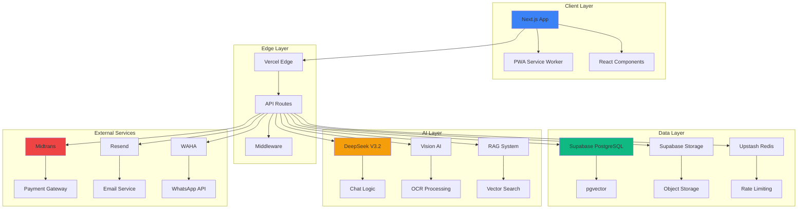
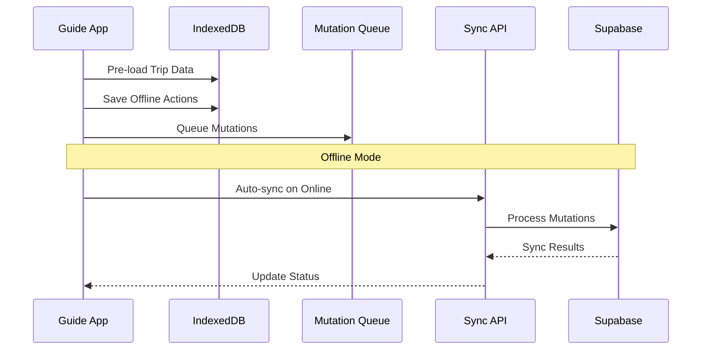
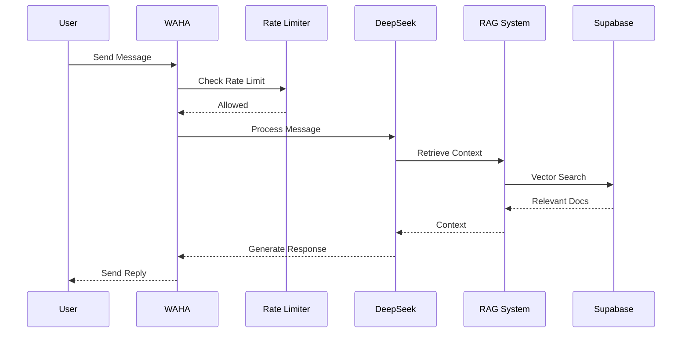
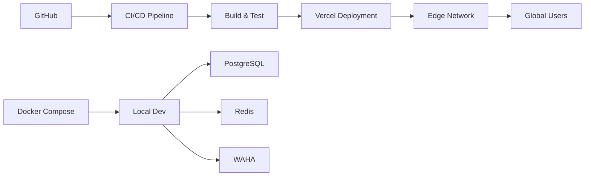

# System Architecture

## Overview

MyAeroTravel ID is built on a **Serverless First, Edge Native, Offline-First, AI-Native** architecture.

## Architecture Diagram

## Data Flow

### Offline-First Flow (Guide App)

### AI Automation Flow (AeroBot)

## Technology Stack

### Core Application Layer
- **Framework:** Next.js 14.2.35+ (App Router)
- **Language:** TypeScript (Strict Mode)
- **PWA:** Serwist
- **State:** TanStack Query v5.59.5 + Zustand v5.0.x
- **Forms:** React Hook Form + Zod
- **UI:** Shadcn UI + Tailwind CSS

### Data & Intelligence Layer
- **Database:** Supabase PostgreSQL + pgvector
- **Storage:** Supabase Storage
- **AI Logic:** DeepSeek-V3.2
- **AI Vision:** DeepSeek-OCR / Gemini Flash
- **Rate Limiting:** Upstash Redis

### Infrastructure
- **Hosting:** Vercel (Edge Network)
- **WhatsApp:** WAHA (Self-Hosted Docker)
- **Payment:** Midtrans
- **Email:** Resend
- **DNS/WAF:** Cloudflare

### Observability
- **Error Tracking:** Sentry
- **Analytics:** PostHog + GA4
- **Logging:** OpenTelemetry
- **Testing:** Playwright

## Security Architecture

### Multi-Tenancy
- Branch-based isolation using `branch_id`
- Row Level Security (RLS) policies
- Feature flags for gradual rollout

### Authentication & Authorization
- Supabase Auth (JWT-based)
- Role-based access control (RBAC)
- Middleware for route protection

### Data Protection
- Input sanitization
- SQL injection prevention (parameterized queries)
- XSS prevention
- Rate limiting on APIs

## Scalability Strategy

### Horizontal Scaling
- Serverless functions (Vercel)
- Edge network distribution
- Database connection pooling (Supavisor)

### Performance Optimization
- ISR for SEO pages
- Image optimization (next/image)
- Code splitting
- Bundle optimization

## Deployment Architecture

## Monitoring & Observability

- **Error Tracking:** Sentry (Real-time error monitoring)
- **Analytics:** PostHog (User journey, funnels)
- **Web Analytics:** GA4 (Traffic, conversions)
- **Performance:** OpenTelemetry (Tracing, metrics)
- **Health Checks:** `/api/health` endpoint

